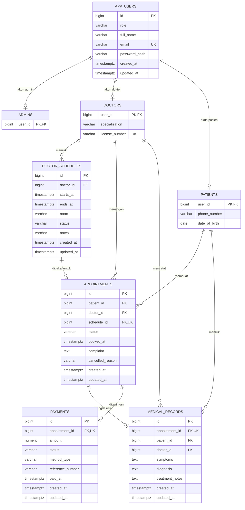

# ERD Sistem Klinikku

ERD berikut dibuat berdasarkan skema database pada `backend/src/main/resources/db/migration/V1__init_schema.sql`.

## Entitas

### 1. `app_users`

Menyimpan data pengguna pada sistem. Entitas ini memiliki atribut `id` sebagai primary key, `role` untuk menentukan peran pengguna, `full_name` untuk nama lengkap, `email` sebagai email login yang bersifat unik, `password_hash` untuk menyimpan password yang sudah di-hash, serta `created_at` dan `updated_at` untuk mencatat waktu pembuatan dan pembaruan data. Entitas ini berelasi dengan entitas `admins`, `doctors`, dan `patients` dengan kardinalitas 1 ke 0..1, karena satu akun pengguna hanya dapat memiliki satu data turunan sesuai perannya, yaitu admin, dokter, atau pasien.

### 2. `admins`

Menyimpan data admin pada sistem. Entitas ini memiliki atribut `user_id` sebagai primary key sekaligus foreign key yang mengacu ke `app_users.id`. Entitas ini berelasi dengan entitas `app_users` dengan kardinalitas 0..1 ke 1, karena satu data admin pasti berasal dari satu akun pengguna, sedangkan satu akun pengguna belum tentu merupakan admin.

### 3. `doctors`

Menyimpan data dokter pada sistem. Entitas ini memiliki atribut `user_id` sebagai primary key sekaligus foreign key yang mengacu ke `app_users.id`, `specialization` untuk menyimpan spesialisasi dokter, dan `license_number` untuk menyimpan nomor izin praktik dokter yang bersifat unik. Entitas ini berelasi dengan entitas `app_users` dengan kardinalitas 0..1 ke 1, karena satu dokter pasti memiliki satu akun pengguna. Entitas ini juga berelasi dengan entitas `doctor_schedules` dengan kardinalitas 1 ke banyak, karena satu dokter dapat memiliki banyak jadwal praktik. Selain itu, entitas ini berelasi dengan entitas `appointments` dengan kardinalitas 1 ke banyak, karena satu dokter dapat menangani banyak janji temu, serta berelasi dengan entitas `medical_records` dengan kardinalitas 1 ke banyak, karena satu dokter dapat mencatat banyak rekam medis.

### 4. `patients`

Menyimpan data pasien pada sistem. Entitas ini memiliki atribut `user_id` sebagai primary key sekaligus foreign key yang mengacu ke `app_users.id`, `phone_number` untuk menyimpan nomor telepon pasien, dan `date_of_birth` untuk menyimpan tanggal lahir pasien. Entitas ini berelasi dengan entitas `app_users` dengan kardinalitas 0..1 ke 1, karena satu pasien pasti memiliki satu akun pengguna. Entitas ini juga berelasi dengan entitas `appointments` dengan kardinalitas 1 ke banyak, karena satu pasien dapat membuat banyak janji temu, serta berelasi dengan entitas `medical_records` dengan kardinalitas 1 ke banyak, karena satu pasien dapat memiliki banyak rekam medis.

### 5. `doctor_schedules`

Menyimpan data jadwal praktik dokter. Entitas ini memiliki atribut `id` sebagai primary key, `doctor_id` sebagai foreign key yang mengacu ke `doctors.user_id`, `starts_at` untuk waktu mulai jadwal, `ends_at` untuk waktu selesai jadwal, `room` untuk ruangan praktik, `status` untuk status jadwal, `notes` untuk catatan tambahan, serta `created_at` dan `updated_at` untuk mencatat waktu pembuatan dan pembaruan data. Entitas ini berelasi dengan entitas `doctors` dengan kardinalitas banyak ke 1, karena banyak jadwal dapat dimiliki oleh satu dokter. Entitas ini juga berelasi dengan entitas `appointments` dengan kardinalitas 1 ke 0..1, karena satu jadwal hanya dapat dipakai oleh maksimal satu janji temu.

### 6. `appointments`

Menyimpan data janji temu antara pasien dan dokter. Entitas ini memiliki atribut `id` sebagai primary key, `patient_id` sebagai foreign key yang mengacu ke `patients.user_id`, `doctor_id` sebagai foreign key yang mengacu ke `doctors.user_id`, `schedule_id` sebagai foreign key yang mengacu ke `doctor_schedules.id`, `status` untuk status janji temu, `booked_at` untuk waktu pemesanan, `complaint` untuk keluhan pasien, `cancelled_reason` untuk alasan pembatalan, serta `created_at` dan `updated_at` untuk mencatat waktu pembuatan dan pembaruan data. Entitas ini berelasi dengan entitas `patients` dengan kardinalitas banyak ke 1, karena banyak janji temu dapat dibuat oleh satu pasien. Entitas ini berelasi dengan entitas `doctors` dengan kardinalitas banyak ke 1, karena banyak janji temu dapat ditangani oleh satu dokter. Entitas ini juga berelasi dengan entitas `doctor_schedules` dengan kardinalitas 0..1 ke 1, karena satu janji temu dapat menggunakan satu jadwal dokter atau tidak memiliki jadwal. Selain itu, entitas ini berelasi dengan entitas `medical_records` dengan kardinalitas 1 ke 0..1 dan dengan entitas `payments` dengan kardinalitas 1 ke 0..1, karena satu janji temu dapat menghasilkan satu rekam medis dan satu pembayaran.

### 7. `medical_records`

Menyimpan data rekam medis pasien dari hasil janji temu. Entitas ini memiliki atribut `id` sebagai primary key, `appointment_id` sebagai foreign key unik yang mengacu ke `appointments.id`, `patient_id` sebagai foreign key yang mengacu ke `patients.user_id`, `doctor_id` sebagai foreign key yang mengacu ke `doctors.user_id`, `symptoms` untuk gejala pasien, `diagnosis` untuk hasil diagnosis, `treatment_notes` untuk catatan tindakan atau perawatan, serta `created_at` dan `updated_at` untuk mencatat waktu pembuatan dan pembaruan data. Entitas ini berelasi dengan entitas `appointments` dengan kardinalitas 0..1 ke 1, karena satu rekam medis hanya berasal dari satu janji temu, sedangkan satu janji temu belum tentu sudah memiliki rekam medis. Entitas ini juga berelasi dengan entitas `patients` dengan kardinalitas banyak ke 1, karena banyak rekam medis dapat dimiliki oleh satu pasien, serta berelasi dengan entitas `doctors` dengan kardinalitas banyak ke 1, karena banyak rekam medis dapat dicatat oleh satu dokter.

### 8. `payments`

Menyimpan data pembayaran untuk janji temu. Entitas ini memiliki atribut `id` sebagai primary key, `appointment_id` sebagai foreign key unik yang mengacu ke `appointments.id`, `amount` untuk nominal pembayaran, `status` untuk status pembayaran, `method_type` untuk metode pembayaran, `reference_number` untuk nomor referensi pembayaran, `paid_at` untuk waktu pembayaran lunas, serta `created_at` dan `updated_at` untuk mencatat waktu pembuatan dan pembaruan data. Entitas ini berelasi dengan entitas `appointments` dengan kardinalitas 0..1 ke 1, karena satu pembayaran hanya terkait dengan satu janji temu, sedangkan satu janji temu belum tentu sudah memiliki pembayaran.

## Ringkasan Kardinalitas

| Relasi | Kardinalitas | Keterangan |
| --- | --- | --- |
| `app_users` ke `admins` | 1 ke 0..1 | User dengan role admin punya satu record admin. |
| `app_users` ke `doctors` | 1 ke 0..1 | User dengan role dokter punya satu record dokter. |
| `app_users` ke `patients` | 1 ke 0..1 | User dengan role pasien punya satu record pasien. |
| `doctors` ke `doctor_schedules` | 1 ke banyak | Dokter dapat memiliki banyak jadwal praktik. |
| `doctors` ke `appointments` | 1 ke banyak | Dokter dapat menangani banyak janji temu. |
| `patients` ke `appointments` | 1 ke banyak | Pasien dapat membuat banyak janji temu. |
| `doctor_schedules` ke `appointments` | 1 ke 0..1 | Satu jadwal hanya dapat dipakai maksimal satu janji temu. |
| `appointments` ke `medical_records` | 1 ke 0..1 | Satu janji temu dapat menghasilkan satu rekam medis. |
| `patients` ke `medical_records` | 1 ke banyak | Pasien dapat memiliki banyak riwayat medis. |
| `doctors` ke `medical_records` | 1 ke banyak | Dokter dapat mencatat banyak rekam medis. |
| `appointments` ke `payments` | 1 ke 0..1 | Satu janji temu dapat memiliki satu pembayaran. |
