# UML Diagram Sistem Klinikku

Dokumen ini dibuat berdasarkan kode backend pada `backend/src/main/java/com/klinikku/backend`. Diagram berfokus pada class utama: entity, service, repository, controller, DTO, enum, dan strategi metode pembayaran.

## Class Diagram

```mermaid
classDiagram
    direction LR

    class BaseEntity {
        -Instant createdAt
        -Instant updatedAt
        +getCreatedAt() Instant
        +getUpdatedAt() Instant
    }

    class User {
        <<abstract>>
        -Long id
        -UserRole role
        -String fullName
        -String email
        -String passwordHash
        +getId() Long
        +getRole() UserRole
        +setRole(UserRole) void
        +getFullName() String
        +setFullName(String) void
        +getEmail() String
        +setEmail(String) void
        +getPasswordHash() String
        +setPasswordHash(String) void
    }

    class Admin
    class Doctor {
        -String specialization
        -String licenseNumber
        +getSpecialization() String
        +setSpecialization(String) void
        +getLicenseNumber() String
        +setLicenseNumber(String) void
    }
    class Patient {
        -String phoneNumber
        -LocalDate dateOfBirth
        +getPhoneNumber() String
        +setPhoneNumber(String) void
        +getDateOfBirth() LocalDate
        +setDateOfBirth(LocalDate) void
    }

    class DoctorSchedule {
        -Long id
        -Doctor doctor
        -OffsetDateTime startsAt
        -OffsetDateTime endsAt
        -String room
        -ScheduleStatus status
        -String notes
        +getId() Long
        +getDoctor() Doctor
        +setDoctor(Doctor) void
        +getStartsAt() OffsetDateTime
        +setStartsAt(OffsetDateTime) void
        +getEndsAt() OffsetDateTime
        +setEndsAt(OffsetDateTime) void
        +getRoom() String
        +setRoom(String) void
        +getStatus() ScheduleStatus
        +setStatus(ScheduleStatus) void
        +getNotes() String
        +setNotes(String) void
    }

    class Appointment {
        -Long id
        -Patient patient
        -Doctor doctor
        -DoctorSchedule schedule
        -AppointmentStatus status
        -OffsetDateTime bookedAt
        -String complaint
        -String cancelledReason
        +getId() Long
        +getPatient() Patient
        +setPatient(Patient) void
        +getDoctor() Doctor
        +setDoctor(Doctor) void
        +getSchedule() DoctorSchedule
        +setSchedule(DoctorSchedule) void
        +getStatus() AppointmentStatus
        +setStatus(AppointmentStatus) void
        +getBookedAt() OffsetDateTime
        +setBookedAt(OffsetDateTime) void
        +getComplaint() String
        +setComplaint(String) void
        +getCancelledReason() String
        +setCancelledReason(String) void
    }

    class MedicalRecord {
        -Long id
        -Appointment appointment
        -Patient patient
        -Doctor doctor
        -String symptoms
        -String diagnosis
        -String treatmentNotes
        +getId() Long
        +getAppointment() Appointment
        +setAppointment(Appointment) void
        +getPatient() Patient
        +setPatient(Patient) void
        +getDoctor() Doctor
        +setDoctor(Doctor) void
        +getSymptoms() String
        +setSymptoms(String) void
        +getDiagnosis() String
        +setDiagnosis(String) void
        +getTreatmentNotes() String
        +setTreatmentNotes(String) void
    }

    class Payment {
        -Long id
        -Appointment appointment
        -BigDecimal amount
        -PaymentStatus status
        -PaymentMethodType methodType
        -String referenceNumber
        -OffsetDateTime paidAt
        +getId() Long
        +getAppointment() Appointment
        +setAppointment(Appointment) void
        +getAmount() BigDecimal
        +setAmount(BigDecimal) void
        +getStatus() PaymentStatus
        +setStatus(PaymentStatus) void
        +getMethodType() PaymentMethodType
        +setMethodType(PaymentMethodType) void
        +getReferenceNumber() String
        +setReferenceNumber(String) void
        +getPaidAt() OffsetDateTime
        +setPaidAt(OffsetDateTime) void
    }

    BaseEntity <|-- User
    User <|-- Admin
    User <|-- Doctor
    User <|-- Patient
    BaseEntity <|-- DoctorSchedule
    BaseEntity <|-- Appointment
    BaseEntity <|-- MedicalRecord
    BaseEntity <|-- Payment

    Doctor "1" --> "0..*" DoctorSchedule : memiliki
    Doctor "1" --> "0..*" Appointment : menangani
    Patient "1" --> "0..*" Appointment : membuat
    DoctorSchedule "0..1" --> "0..1" Appointment : dipakai
    Appointment "1" --> "0..1" MedicalRecord : menghasilkan
    Appointment "1" --> "0..1" Payment : ditagihkan
    Doctor "1" --> "0..*" MedicalRecord : mencatat
    Patient "1" --> "0..*" MedicalRecord : memiliki

    class DoctorService {
        +findAll() List~DoctorResponse~
        +findById(Long) Doctor
        +create(DoctorRequest) DoctorResponse
        +update(Long, DoctorRequest) DoctorResponse
        +deleteById(Long) void
    }
    class PatientService {
        +findAll() List~PatientResponse~
        +findById(Long) Patient
        +create(PatientRequest) PatientResponse
        +update(Long, PatientRequest) PatientResponse
        +deleteById(Long) void
    }
    class ScheduleService {
        +findAll() List~ScheduleResponse~
        +findAll(Long, ScheduleStatus) List~ScheduleResponse~
        +findAvailableUnassigned(Long, OffsetDateTime, OffsetDateTime) List~ScheduleResponse~
        +findById(Long) DoctorSchedule
        +create(ScheduleRequest) ScheduleResponse
        +update(Long, ScheduleRequest) ScheduleResponse
        +createBookedSlot(ScheduleRequest) DoctorSchedule
        +updateBookedSlot(Long, ScheduleRequest) DoctorSchedule
        +markAsBooked(DoctorSchedule) DoctorSchedule
        +deleteBookedSlot(DoctorSchedule) void
        +deleteById(Long) void
    }
    class AppointmentService {
        +findAll() List~AppointmentResponse~
        +findAll(Long, Long, AppointmentStatus) List~AppointmentResponse~
        +findById(Long) Appointment
        +findResponseById(Long) AppointmentResponse
        +findResponseByIdForDoctor(Long, Long) AppointmentResponse
        +findResponseByIdForPatient(Long, Long) AppointmentResponse
        +create(AppointmentRequest) AppointmentResponse
        +createForDoctor(AppointmentRequest, Long) AppointmentResponse
        +createForPatient(Long, PatientAppointmentRequest) AppointmentResponse
        +update(Long, AppointmentRequest) AppointmentResponse
        +updateForDoctor(Long, AppointmentRequest, Long) AppointmentResponse
        +updateStatus(Long, AppointmentStatusRequest) AppointmentResponse
        +updateStatusForDoctor(Long, AppointmentStatusRequest, Long) AppointmentResponse
        +cancelForPatient(Long, Long, String) AppointmentResponse
        +deleteById(Long) void
        +deleteByIdForDoctor(Long, Long) void
    }
    class MedicalRecordService {
        +findAll() List~MedicalRecordResponse~
        +findResponseById(Long) MedicalRecordResponse
        +findAllForDoctor(Long) List~MedicalRecordResponse~
        +findResponseByIdForDoctor(Long, Long) MedicalRecordResponse
        +findAllForPatient(Long) List~MedicalRecordResponse~
        +findResponseByIdForPatient(Long, Long) MedicalRecordResponse
        +createForDoctor(Long, MedicalRecordRequest) MedicalRecordResponse
    }
    class PaymentService {
        +findAll() List~PaymentResponse~
        +findById(Long) Payment
        +findResponseById(Long) PaymentResponse
        +findAllForPatient(Long) List~PaymentResponse~
        +findResponseByIdForPatient(Long, Long) PaymentResponse
        +create(PaymentRequest) PaymentResponse
        +updateStatus(Long, PaymentStatusRequest) PaymentResponse
    }
    class AuthService {
        +login(LoginRequest) LoginResult
        +createSessionCookie(String) ResponseCookie
        +createLogoutCookie() ResponseCookie
    }
    class JwtService {
        +createToken(AuthenticatedUser) String
        +parseToken(String) Optional~AuthenticatedUser~
    }

    DoctorService --> DoctorRepository
    PatientService --> PatientRepository
    ScheduleService --> DoctorScheduleRepository
    ScheduleService --> DoctorService
    AppointmentService --> AppointmentRepository
    AppointmentService --> PatientService
    AppointmentService --> DoctorService
    AppointmentService --> ScheduleService
    MedicalRecordService --> MedicalRecordRepository
    MedicalRecordService --> AppointmentService
    PaymentService --> PaymentRepository
    PaymentService --> AppointmentService
    AuthService --> UserRepository
    AuthService --> JwtService

    class PaymentMethod {
        <<interface>>
        +type() PaymentMethodType
        +displayName() String
    }
    class CashPaymentMethod {
        +type() PaymentMethodType
        +displayName() String
    }
    class TransferPaymentMethod {
        +type() PaymentMethodType
        +displayName() String
    }
    class EWalletPaymentMethod {
        +type() PaymentMethodType
        +displayName() String
    }
    class PaymentMethodCatalog {
        +supportedMethods() List~PaymentMethod~
    }
    PaymentMethod <|.. CashPaymentMethod
    PaymentMethod <|.. TransferPaymentMethod
    PaymentMethod <|.. EWalletPaymentMethod
    PaymentMethodCatalog --> PaymentMethod

    class UserRole {
        <<enumeration>>
        ADMIN
        DOCTOR
        PATIENT
    }
    class AppointmentStatus {
        <<enumeration>>
        MENUNGGU
        DISETUJUI
        SELESAI
        DIBATALKAN
    }
    class ScheduleStatus {
        <<enumeration>>
        AVAILABLE
        BOOKED
        CANCELLED
    }
    class PaymentStatus {
        <<enumeration>>
        BELUM_BAYAR
        LUNAS
        DIBATALKAN
    }
    class PaymentMethodType {
        <<enumeration>>
        CASH
        TRANSFER
        EWALLET
    }
```

## Main Classes and Methods

### Entity Classes

| Class | Main responsibility | Main methods |
| --- | --- | --- |
| `BaseEntity` | Superclass untuk timestamp audit. | `getCreatedAt()`, `getUpdatedAt()` |
| `User` | Superclass akun pengguna. | `getId()`, `getRole()`, `setRole()`, `getFullName()`, `setFullName()`, `getEmail()`, `setEmail()`, `getPasswordHash()`, `setPasswordHash()` |
| `Admin` | Entity admin, turunan `User`. | Mewarisi method dari `User`. |
| `Doctor` | Entity dokter, turunan `User`. | `getSpecialization()`, `setSpecialization()`, `getLicenseNumber()`, `setLicenseNumber()` |
| `Patient` | Entity pasien, turunan `User`. | `getPhoneNumber()`, `setPhoneNumber()`, `getDateOfBirth()`, `setDateOfBirth()` |
| `DoctorSchedule` | Jadwal praktik dokter. | `getId()`, `getDoctor()`, `setDoctor()`, `getStartsAt()`, `setStartsAt()`, `getEndsAt()`, `setEndsAt()`, `getRoom()`, `setRoom()`, `getStatus()`, `setStatus()`, `getNotes()`, `setNotes()` |
| `Appointment` | Janji temu pasien dengan dokter. | `getId()`, `getPatient()`, `setPatient()`, `getDoctor()`, `setDoctor()`, `getSchedule()`, `setSchedule()`, `getStatus()`, `setStatus()`, `getBookedAt()`, `setBookedAt()`, `getComplaint()`, `setComplaint()`, `getCancelledReason()`, `setCancelledReason()` |
| `MedicalRecord` | Rekam medis dari appointment. | `getId()`, `getAppointment()`, `setAppointment()`, `getPatient()`, `setPatient()`, `getDoctor()`, `setDoctor()`, `getSymptoms()`, `setSymptoms()`, `getDiagnosis()`, `setDiagnosis()`, `getTreatmentNotes()`, `setTreatmentNotes()` |
| `Payment` | Pembayaran appointment. | `getId()`, `getAppointment()`, `setAppointment()`, `getAmount()`, `setAmount()`, `getStatus()`, `setStatus()`, `getMethodType()`, `setMethodType()`, `getReferenceNumber()`, `setReferenceNumber()`, `getPaidAt()`, `setPaidAt()` |

### Service Classes

| Class | Main methods |
| --- | --- |
| `DoctorService` | `findAll()`, `findById(Long)`, `create(DoctorRequest)`, `update(Long, DoctorRequest)`, `deleteById(Long)` |
| `PatientService` | `findAll()`, `findById(Long)`, `create(PatientRequest)`, `update(Long, PatientRequest)`, `deleteById(Long)` |
| `ScheduleService` | `findAll()`, `findAll(Long, ScheduleStatus)`, `findAvailableUnassigned(Long, OffsetDateTime, OffsetDateTime)`, `findById(Long)`, `create(ScheduleRequest)`, `update(Long, ScheduleRequest)`, `createBookedSlot(ScheduleRequest)`, `updateBookedSlot(Long, ScheduleRequest)`, `markAsBooked(DoctorSchedule)`, `deleteBookedSlot(DoctorSchedule)`, `deleteById(Long)` |
| `AppointmentService` | `findAll()`, `findAll(Long, Long, AppointmentStatus)`, `findById(Long)`, `findResponseById(Long)`, `findResponseByIdForDoctor(Long, Long)`, `findResponseByIdForPatient(Long, Long)`, `create(AppointmentRequest)`, `createForDoctor(AppointmentRequest, Long)`, `createForPatient(Long, PatientAppointmentRequest)`, `update(Long, AppointmentRequest)`, `updateForDoctor(Long, AppointmentRequest, Long)`, `updateStatus(Long, AppointmentStatusRequest)`, `updateStatusForDoctor(Long, AppointmentStatusRequest, Long)`, `cancelForPatient(Long, Long, String)`, `deleteById(Long)`, `deleteByIdForDoctor(Long, Long)` |
| `MedicalRecordService` | `findAll()`, `findResponseById(Long)`, `findAllForDoctor(Long)`, `findResponseByIdForDoctor(Long, Long)`, `findAllForPatient(Long)`, `findResponseByIdForPatient(Long, Long)`, `createForDoctor(Long, MedicalRecordRequest)` |
| `PaymentService` | `findAll()`, `findById(Long)`, `findResponseById(Long)`, `findAllForPatient(Long)`, `findResponseByIdForPatient(Long, Long)`, `create(PaymentRequest)`, `updateStatus(Long, PaymentStatusRequest)` |
| `AuthService` | `login(LoginRequest)`, `createSessionCookie(String)`, `createLogoutCookie()` |
| `JwtService` | `createToken(AuthenticatedUser)`, `parseToken(String)` |

### Repository Interfaces

| Interface | Extends | Custom methods |
| --- | --- | --- |
| `UserRepository` | `JpaRepository<User, Long>` | `findByEmail(String)` |
| `DoctorRepository` | `JpaRepository<Doctor, Long>` | `findByLicenseNumber(String)` |
| `PatientRepository` | `JpaRepository<Patient, Long>` | - |
| `DoctorScheduleRepository` | `JpaRepository<DoctorSchedule, Long>`, `JpaSpecificationExecutor<DoctorSchedule>` | `findByFilters(Long, ScheduleStatus)`, `findAvailableUnassigned(Long, OffsetDateTime, OffsetDateTime)`, `existsActiveOverlap(Long, OffsetDateTime, OffsetDateTime, Long)` |
| `AppointmentRepository` | `JpaRepository<Appointment, Long>`, `JpaSpecificationExecutor<Appointment>` | `existsByScheduleId(Long)`, `findByFilters(Long, Long, AppointmentStatus)` |
| `MedicalRecordRepository` | `JpaRepository<MedicalRecord, Long>` | `findByDoctor_IdOrderByCreatedAtDesc(Long)`, `findByPatient_IdOrderByCreatedAtDesc(Long)`, `existsByAppointment_Id(Long)` |
| `PaymentRepository` | `JpaRepository<Payment, Long>` | `existsByAppointment_Id(Long)`, `findByAppointment_Patient_IdOrderByCreatedAtDesc(Long)` |

### Controller Classes

| Class | Base endpoint | Main methods |
| --- | --- | --- |
| `AuthController` | `/api/v1/auth` | `login(LoginRequest, HttpServletResponse)`, `logout(HttpServletResponse)`, `me(AuthenticatedUser)` |
| `HealthController` | `/api/v1/health` | `getHealth()` |
| `AdminDoctorController` | `/api/v1/admin/doctors` | `listDoctors()`, `createDoctor(DoctorRequest)`, `updateDoctor(Long, DoctorRequest)`, `deleteDoctor(Long)` |
| `AdminPatientController` | `/api/v1/admin/patients` | `listPatients()`, `createPatient(PatientRequest)`, `updatePatient(Long, PatientRequest)`, `deletePatient(Long)` |
| `AdminScheduleController` | `/api/v1/admin/schedules` | `listSchedules(Long, ScheduleStatus)`, `createSchedule(ScheduleRequest)`, `updateSchedule(Long, ScheduleRequest)`, `deleteSchedule(Long)` |
| `AdminAppointmentController` | `/api/v1/admin/appointments` | `listAppointments(Long, Long, AppointmentStatus)`, `getAppointment(Long)`, `createAppointment(AppointmentRequest)`, `updateAppointment(Long, AppointmentRequest)`, `updateAppointmentStatus(Long, AppointmentStatusRequest)`, `deleteAppointment(Long)` |
| `AdminMedicalRecordController` | `/api/v1/admin/records` | `listRecords()`, `getRecord(Long)` |
| `AdminPaymentController` | `/api/v1/admin/payments` | `listPayments()`, `getPayment(Long)`, `createPayment(PaymentRequest)`, `updatePaymentStatus(Long, PaymentStatusRequest)` |
| `DoctorPatientController` | `/api/v1/doctor/patients` | `listPatients()` |
| `DoctorAppointmentController` | `/api/v1/doctor/appointments` | `listAppointments(AuthenticatedUser, Long, AppointmentStatus)`, `getAppointment(AuthenticatedUser, Long)`, `createAppointment(AuthenticatedUser, AppointmentRequest)`, `updateAppointment(AuthenticatedUser, Long, AppointmentRequest)`, `updateAppointmentStatus(AuthenticatedUser, Long, AppointmentStatusRequest)`, `deleteAppointment(AuthenticatedUser, Long)` |
| `DoctorMedicalRecordController` | `/api/v1/doctor/records` | `listRecords(AuthenticatedUser)`, `getRecord(AuthenticatedUser, Long)`, `createRecord(AuthenticatedUser, MedicalRecordRequest)` |
| `PatientScheduleController` | `/api/v1/patient/schedules` | `listAvailableSchedules(Long, OffsetDateTime, OffsetDateTime)` |
| `PatientAppointmentController` | `/api/v1/patient/appointments` | `listAppointments(AuthenticatedUser, Long, AppointmentStatus)`, `getAppointment(AuthenticatedUser, Long)`, `requestAppointment(AuthenticatedUser, PatientAppointmentRequest)`, `cancelAppointment(AuthenticatedUser, Long, PatientAppointmentCancelRequest)` |
| `PatientMedicalRecordController` | `/api/v1/patient/records` | `listRecords(AuthenticatedUser)`, `getRecord(AuthenticatedUser, Long)` |
| `PatientPaymentController` | `/api/v1/patient/payments` | `listPayments(AuthenticatedUser)`, `getPayment(AuthenticatedUser, Long)` |

### DTO and Enum Classes

| Type | Classes |
| --- | --- |
| Request DTO | `LoginRequest`, `DoctorRequest`, `PatientRequest`, `ScheduleRequest`, `AppointmentRequest`, `AppointmentStatusRequest`, `PatientAppointmentRequest`, `PatientAppointmentCancelRequest`, `MedicalRecordRequest`, `PaymentRequest`, `PaymentStatusRequest` |
| Response DTO | `AuthUserResponse`, `HealthResponse`, `DoctorResponse`, `PatientResponse`, `ScheduleResponse`, `AppointmentResponse`, `MedicalRecordResponse`, `PaymentResponse` |
| Auth DTO | `AuthenticatedUser`, `LoginResult` |
| Enum | `UserRole`, `AppointmentStatus`, `ScheduleStatus`, `PaymentStatus`, `PaymentMethodType` |

### Payment Method Strategy

| Class / Interface | Main methods |
| --- | --- |
| `PaymentMethod` | `type()`, `displayName()` |
| `CashPaymentMethod` | `type()`, `displayName()` |
| `TransferPaymentMethod` | `type()`, `displayName()` |
| `EWalletPaymentMethod` | `type()`, `displayName()` |
| `PaymentMethodCatalog` | `supportedMethods()` |
